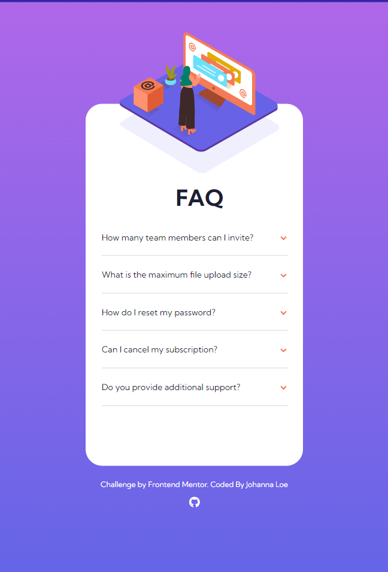
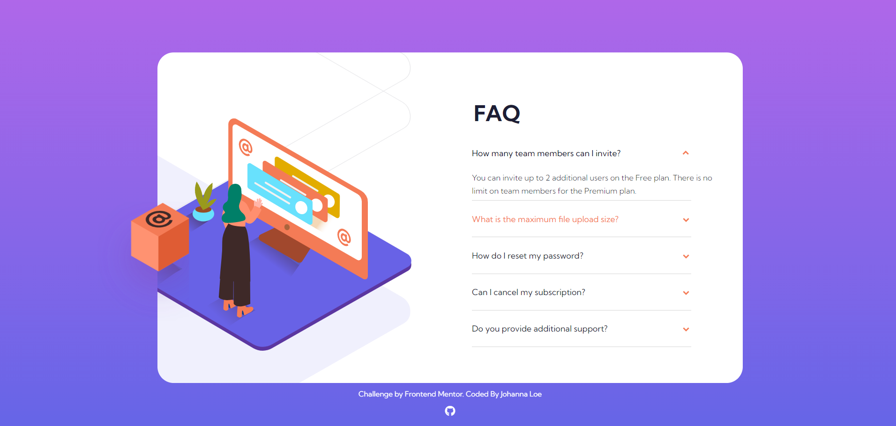

# Frontend Mentor - FAQ accordion card solution by JVLoe

This is a solution to the [FAQ accordion card challenge on Frontend Mentor](https://www.frontendmentor.io/challenges/faq-accordion-card-XlyjD0Oam). Frontend Mentor challenges help you improve your coding skills by building realistic projects.

## Table of contents

- [Overview](#overview)
    - [The challenge](#the-challenge)
    - [Screenshot](#screenshot)
    - [Links](#links)
    - [Built with](#built-with)
    - [Continued development](#continued-development)
- [Author](#author)

## Overview

### The challenge

Users should be able to:

- View the optimal layout for the component depending on their device's screen size
- See hover states for all interactive elements on the page
- Hide/Show the answer to a question when the question is clicked

### Screenshot

### Links

- Solution URL: (https://github.com/JVLoe/freecodecamp-accordioncard)
- Live Site URL: (https://jvloe.github.io/freecodecamp-accordioncard/)

### Built with

- Semantic HTML5 markup
- Flexbox
- CSS Grid
- Mobile-first workflow

### Continued development

- I plan to continue developing this app with React and then Angular

## Author

- Website - [Johanna Loe](https://jvloe.github.io/portfolio1.2/)
- Frontend Mentor - [@yJVLoe](https://www.frontendmentor.io/profile/JVLoe)

